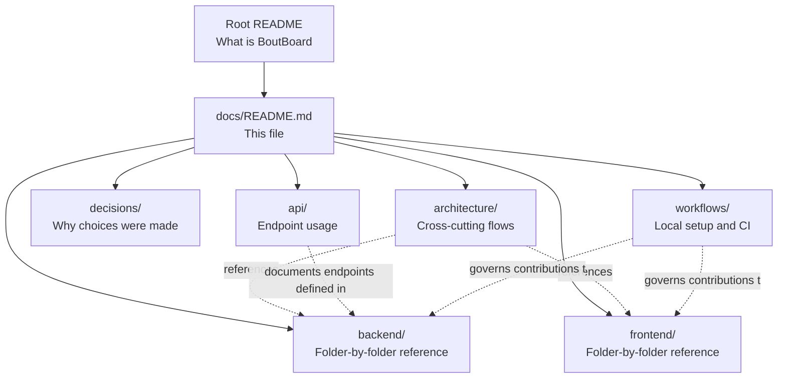

# BoutBoard documentation

This is the entry point for BoutBoard's technical documentation. If the root `README.md` told you _what_ BoutBoard is, this section tells you _how it is built_ and _how to work on it_.

The documentation is organized so that each question a contributor might have maps to exactly one place to look — not scattered across code comments or a single giant file.

## How to navigate

Pick the row that matches what you're trying to do.

| I want to...                                                                   | Start here                          |
| ------------------------------------------------------------------------------ | ----------------------------------- |
| Understand the system before touching any code                                 | `architecture/overview.md`          |
| Know why a technical choice was made a certain way                             | `decisions/`                        |
| Add or modify backend code and need to know where it belongs                   | `backend/`                          |
| Add or modify frontend code and need to know where it belongs                  | `frontend/`                         |
| Understand how a score event travels from the operator to the spectator screen | `architecture/websocket-flow.md`    |
| Understand a REST request's path through the backend                           | `architecture/request-lifecycle.md` |
| Call or test an endpoint without reading controller code                       | `api/rest-api.md`                   |
| Set up the project locally and open a pull request                             | `workflows/development-workflow.md` |
| Understand what happens after a PR is merged                                   | `workflows/ci-cd.md`                |
| Understand how the app is packaged and run in production                       | `architecture/deployment.md`        |

If you're new to the project entirely, read `architecture/overview.md` first — everything else assumes that context.

## Documentation map

Status legend: ✅ available · 🚧 planned, not yet written · 🔮 describes a feature that doesn't exist in the codebase yet (design intent, not reference).

### Architecture

Cross-cutting explanations of how subsystems work together. These describe _flows_, not folders.

| Document                                                       | Status | Covers                                                                                 |
| -------------------------------------------------------------- | ------ | -------------------------------------------------------------------------------------- |
| [Overview](architecture/Overview.md)                           | 🚧     | Full system architecture: how frontend, backend, database, and deployment fit together |
| [Backend-architecture](architecture/Backend-architecture.md)   | 🚧     | Package relationships and layering inside the Spring Boot app                          |
| [Frontend-architecture](architecture/Frontend-architecture.md) | 🚧     | Vue app structure, state management, and data flow                                     |
| [Request-lifecycle](architecture/Request-lifecycle.md)         | 🚧     | A REST request's path: controller → service → repository → database                    |
| [websocket](backend/websocket.md)                              | 🚧     | A score/penalty event's path over STOMP, from operator action to spectator screen      |
| [Database](architecture/Database.md)                           | 🚧     | Schema design, JPA entity mapping, Flyway migration strategy                           |
| `authentication.md`                                            | 🔮     | Planned Spring Security + JWT design (not implemented yet)                             |
| [Deployment](architecture/Deployment.md)                       | 🚧     | Docker/Compose packaging and deployment topology                                       |
|                                                                |        |                                                                                        |

### Decisions

Short, numbered records explaining _why_ a non-obvious technical choice was made. Read these before proposing to change something that looks questionable at first glance — there may already be a documented reason.

| Document                                                                                | Status | Decision                                                              |
| --------------------------------------------------------------------------------------- | ------ | --------------------------------------------------------------------- |
| [0001-monorepo-structure](decisions/0001-monorepo-structure.md)                         | 🚧     | Single repo for frontend + backend instead of split repos             |
| [0002-native-websocket-over-socketio](decisions/0002-native-websocket-over-socketio.md) | 🚧     | Native WebSocket + STOMP instead of Socket.IO                         |
| [0003-configurable-rules-engine](decisions/0003-configurable-rules-engine.md)           | 🚧     | Scoring rules as configuration instead of hardcoded per-sport modules |

New decisions are added as new numbered files — existing ones are never edited after acceptance. If a decision is later reversed, a new ADR supersedes it and says so explicitly; the old one stays as history.

### Backend

One file per top-level package under `backend/src/main/java/.../boutboard/`. Each explains that folder's responsibility, what belongs in it, and what doesn't.

| Document                            | Status |
| ----------------------------------- | ------ |
| [config](backend/config.md)         | 🚧     |
| [controller](backend/controller.md) | 🚧     |
| [dto](backend/dto.md)               | 🚧     |
| [entity](backend/entity.md)         | 🚧     |
| [mapper](backend/mapper.md)         | 🚧     |
| [repository](backend/repository.md) | 🚧     |
| [service](backend/service.md)       | 🚧     |
| [websocket](backend/websocket.md)   | 🚧     |
| [exception](backend/exception.md)   | 🚧     |

### Frontend

One file per top-level folder under `frontend/src/`.

| Document                               | Status |
| -------------------------------------- | ------ |
| [components](frontend/components.md)   | 🚧     |
| [views](frontend/views.md)             | 🚧     |
| [router](frontend/router.md)           | 🚧     |
| [stores](frontend/stores.md)           | 🚧     |
| [services](frontend/services.md)       | 🚧     |
| [composables](frontend/composables.md) | 🚧     |

### API

| Document                                    | Status | Covers                                                          |
| ------------------------------------------- | ------ | --------------------------------------------------------------- |
| [Rest-api](api/Rest-api.md)                 | 🚧     | Endpoint reference and REST conventions                         |
| [Bruno-collection](api/Bruno-collection.md) | 🚧     | How the Bruno collection is organized and how to run it locally |

### Workflows

| Document                                                  | Status | Covers                                              |
| --------------------------------------------------------- | ------ | --------------------------------------------------- |
| [Development-workflow](workflows/Development-workflow.md) | 🚧     | Local setup, branching strategy, commit conventions |
| [ci-cd](workflows/ci-cd.md)                               | 🚧     | GitHub Actions pipeline: what runs on push/PR       |

## How the documentation is structured

Solid arrows mean "contains". Dashed arrows mean "reads from" — for example, `websocket-flow.md` in `architecture/` will explain the event flow in prose and diagrams, and point into `backend/websocket.md` for the folder-level detail, rather than duplicating it.

## Documentation conventions

These apply across every file in `docs/`:

- **Audience**: written for someone who has never read the source code, but is comfortable with Spring Boot, Vue, and general web architecture.
- **Diagrams**: Mermaid, rendered directly in the `.md` file — never a separate diagram file or an exported image, so diagrams stay reviewable in pull request diffs.
- **Tone**: plain, direct, technical English. No marketing language.
- **Scope boundary**: `architecture/*.md` explains _flows across_ folders; `backend/*.md` and `frontend/*.md` explain _what's inside_ one folder. If content could live in either, it belongs in the folder-level doc, and the architecture doc links to it instead of repeating it.
- **Status markers**: every planned or design-intent document is marked 🚧 or 🔮 in this index until it's written — the index is never allowed to imply a document exists when it doesn't.

## Contributing to the documentation

Documentation changes follow the same pull request process as code — see `workflows/development-workflow.md`. See the root `CONTRIBUTING.md` for the full contribution process, including how to propose a new architecture decision record.