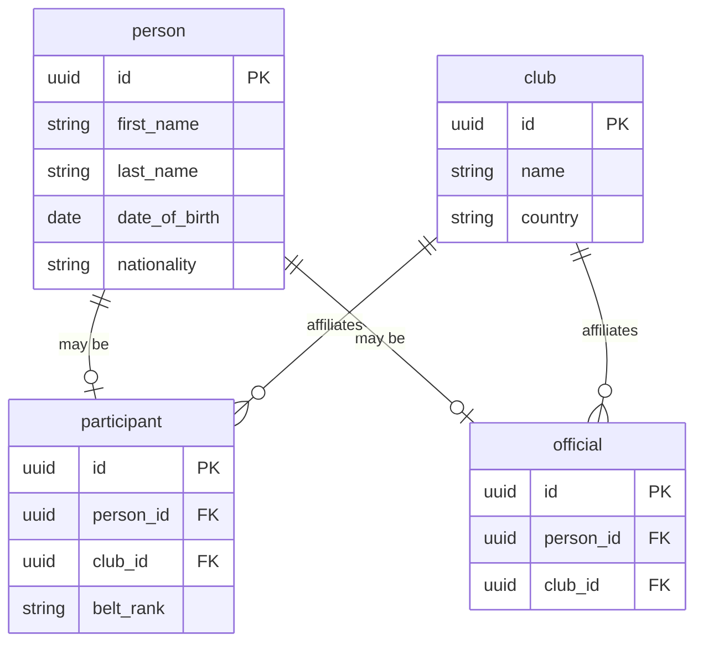
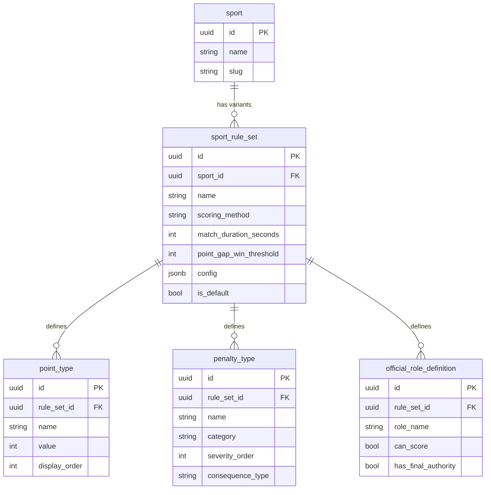
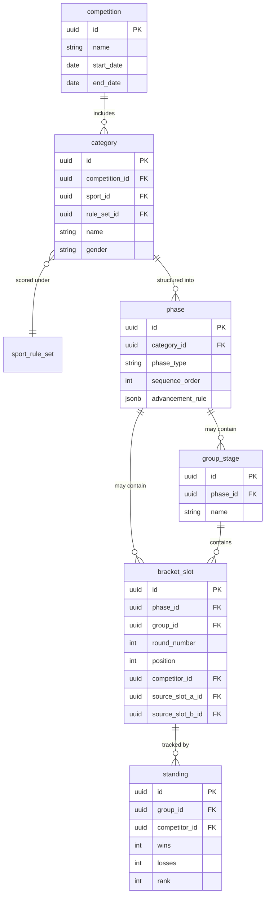
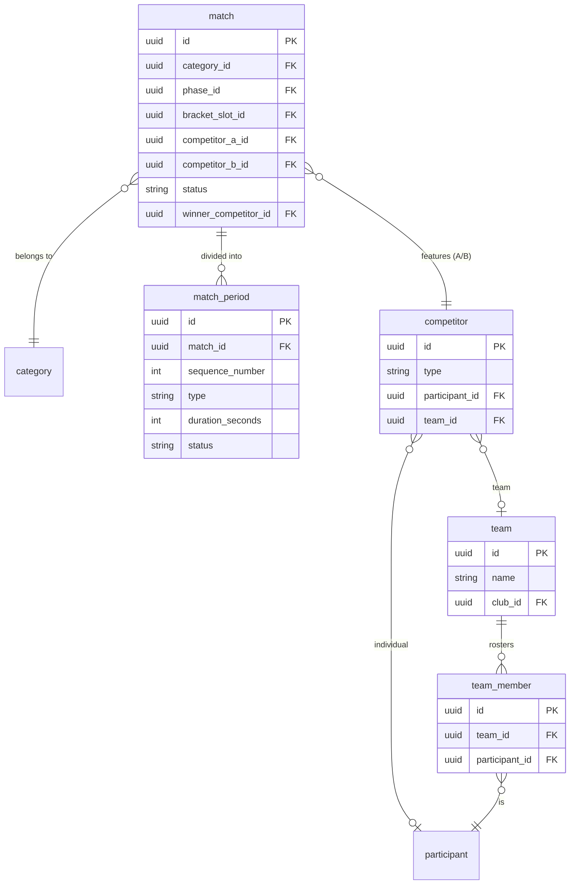
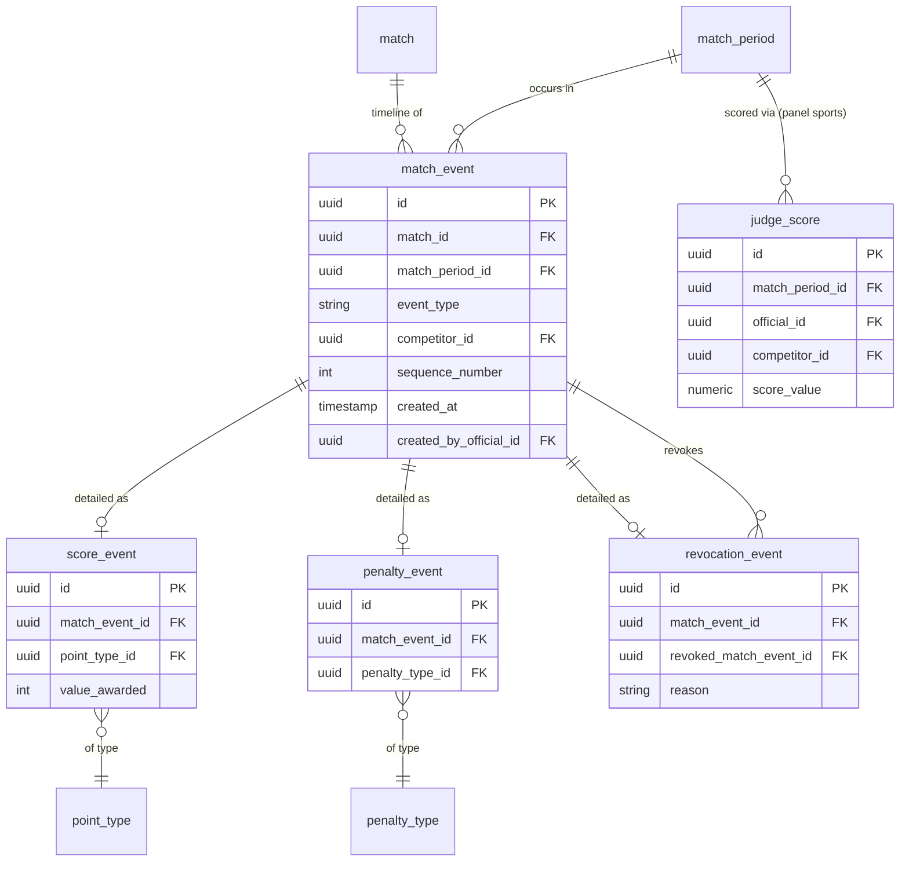
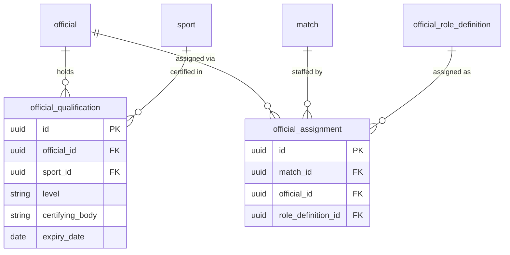
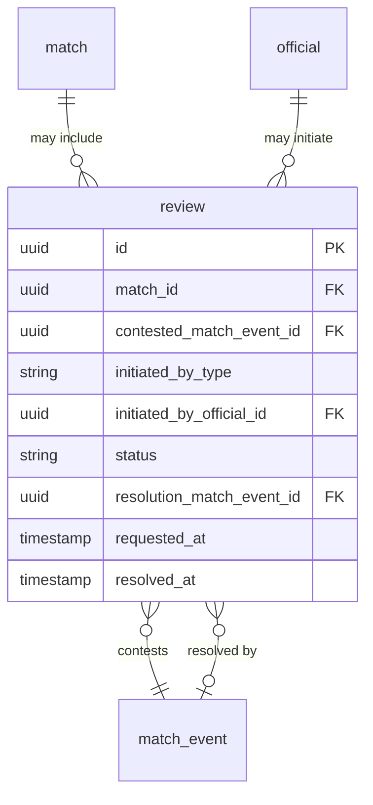

# Database & persistence layer
#architecture 
This is the most foundational document in the architecture set. It defines not just today's schema, but the complete long-term data model BoutBoard is being designed against — including concepts not yet implemented. Where [Overview](Overview.md) says _what exists today_, this document says _what the data model is capable of_, so that building toward it later never requires tearing up what came before.


**Quick navigation**

1. [Domain analysis: what actually varies across combat sports](#1.%20Domain%20analysis%20what%20actually%20varies%20across%20combat%20sports)
2. [Extensibility strategy](#2.%20Extensibility%20strategy)
3. [Entity catalog](#3.%20Entity%20catalog)
4. [Entity groups in detail](#4.%20Entity%20groups%20in%20detail)
5. [Constraints & indexing strategy](#5.%20Constraints%20&%20indexing%20strategy)
6. [Flyway migration strategy](#6.%20Flyway%20migration%20strategy)
7. [Extensibility playbook: adding a new sport](#7.%20Extensibility%20playbook%20adding%20a%20new%20sport)
8. [Current implementation scope](#8.%20Current%20implementation%20scope)
9. [Open questions / candidate future ADRs](#9.%20Open%20questions%20/%20candidate%20future%20ADRs)

---

## 1. Domain analysis: what actually varies across combat sports

Before modeling anything, it's worth being explicit about _why_ a multi-sport scoreboard is a genuinely harder data problem than a Kumite-only one — otherwise "make it flexible" stays a vague aspiration instead of a design constraint. Comparing Karate Kumite against a handful of other combat sports surfaces six axes of real variation:

| Axis                     | Karate Kumite                                                                                                         | Contrast example                                                                                                                                                                                                                   | Why it matters for the schema                                                                                                                                                                                                                                                                                |
| ------------------------ | --------------------------------------------------------------------------------------------------------------------- | ---------------------------------------------------------------------------------------------------------------------------------------------------------------------------------------------------------------------------------- | ------------------------------------------------------------------------------------------------------------------------------------------------------------------------------------------------------------------------------------------------------------------------------------------------------------ |
| **Scoring mechanism**    | Discrete point events (Yuko/Waza-ari/Ippon), awarded live, summed over time                                           | Karate _Kata_ and Olympic boxing: a panel of judges independently scores at fixed checkpoints (end of performance / end of round), then an aggregation rule decides the outcome — there's no running total during the match at all | These aren't the same shape of data. A "current score" model for Kumite has nothing to map to in Kata. [ADR-0003](../decisions/0003-configurable-rules-engine.md) already flagged this as a gap — this document is where it gets resolved (see [2. Extensibility strategy](#2.%20Extensibility%20strategy)). |
| **Officials**            | One deciding referee + corner judges signaling flags, plus table officials                                            | Kata: a panel of 5–7 judges who all score directly, no single "final say" role. Some formats add a supervisor role with override authority                                                                                         | The _number_, _scoring authority_, and _final-say status_ of officials is sport-specific, not just their job titles.                                                                                                                                                                                         |
| **Penalties**            | Two categories (contact control, unsportsmanlike conduct), each with escalating tiers, escalating to disqualification | Judo's Shido penalties escalate to direct disqualification after a fixed count, and different rule eras have varied on whether a penalty also hands the opponent a scoring point                                                   | Penalty _consequences_ (does it end the match? does it score the opponent?) vary by sport and even by rule-set revision within the same sport.                                                                                                                                                               |
| **Match structure**      | One continuous timed period                                                                                           | Boxing: multiple independently judged rounds. Judo: a regular period plus sudden-death overtime ("Golden Score")                                                                                                                   | A match isn't always one segment. Round-based judging in particular needs a first-class "segment" concept, not just a single match-level clock.                                                                                                                                                              |
| **Tournament format**    | Group stage → elimination bracket (as scoped for BoutBoard's first release)                                           | Pure single elimination with repechage for bronze (common in judo/karate internationally), round-robin-only with ranking-based results, double elimination                                                                         | "Groups then a bracket" is one format among several — the schema shouldn't assume it's the only one.                                                                                                                                                                                                         |
| **Reviews / challenges** | Judge panel conferral, initiated by an on-mat official                                                                | Coach-initiated video review with a limited challenge count per athlete, seen in some taekwondo and judo formats                                                                                                                   | Not every sport has this concept at all, and where it exists, who can initiate it and what it can overturn both vary.                                                                                                                                                                                        |

The throughline: **some of this variation is just different numbers (point values, durations, penalty counts) — but some of it is a different _kind_ of thing entirely (how scoring fundamentally works).** [ADR-0003](../decisions/0003-configurable-rules-engine.md) solved the first kind. This document extends that solution to also cover the second.

## 2. Extensibility strategy

Two strategies were considered for handling the "different kind of thing" problem above:

- **Fully relational, purpose-built tables for every concept** — maximum query power and referential integrity, but every new sport-specific wrinkle becomes a schema migration, which is exactly the rigidity this project is trying to avoid.
- **A single generic entity with a JSONB payload for everything** (pure EAV-style) — maximum flexibility, but sacrifices foreign-key integrity, indexing, and query clarity even for the concepts we already understand well today (a score event referencing a point type should be a real foreign key, not a string buried in JSON).

**Decision: a hybrid.** Two techniques, applied deliberately rather than uniformly:

1. **Configuration-as-data for parameters** (already established by [ADR-0003](../decisions/0003-configurable-rules-engine.md)): point values, match duration, win thresholds, penalty tiers, and official roles are rows in configuration tables (`point_type`, `penalty_type`, `official_role_definition`), scoped to a `sport_rule_set`. Adding a sport whose rules differ only in these values requires inserting rows, not writing code.
2. **A polymorphic event log with typed companions for mechanisms** (new in this document): every match event — regardless of sport — is first recorded as a row in a single append-only `match_event` table, giving every match one queryable, chronologically ordered timeline no matter what sport it is. For event types the system already understands deeply (`SCORE`, `PENALTY`, `REVOCATION`), a strongly-typed companion table (`score_event`, `penalty_event`, `revocation_event`) hangs off `match_event` in a 1:1 relationship, giving full foreign-key integrity for those. A genuinely novel event type introduced by a future sport can exist as a `match_event` row with a JSONB payload and _no_ companion table at first — usable immediately, and promoted to a proper typed table (via a normal migration) once it's common enough to justify one.

This is deliberately not a uniform rule — it's a judgment call, made per-concept, between "we understand this well enough to model it strictly today" and "we don't yet, and forcing a strict model now would be guessing." Section 9 lists where that judgment call might be revisited.

The same reasoning applies to `sport_rule_set.config` (JSONB): first-class parameters that every sport shares (duration, win threshold) are real columns; parameters only relevant to specific rule-set variants (e.g. a Golden Score overtime duration, a list of weight categories) live in that JSONB column rather than adding sport-specific nullable columns to a shared table.

## 3. Entity catalog

All entities across every group, for scanning. "Scope" reflects [8. Current implementation scope](#8.%20Current%20implementation%20scope): **live** entities exist in the v1 migration set today; **modeled** entities are fully designed here but not yet migrated, and get their migration when their feature is built.

|Entity|Group|Purpose|Scope|
|---|---|---|---|
|`person`|Identity|Shared identity for anyone — competitor or official|Live|
|`club`|Identity|Affiliation / organization|Live|
|`participant`|Identity|Competitor profile for an individual|Live|
|`official`|Identity|Official profile (referee, judge, etc.)|Live|
|`sport`|Sport config|A supported combat sport|Live|
|`sport_rule_set`|Sport config|A versioned rules configuration for a sport|Live|
|`point_type`|Sport config|A scoreable point category and its value|Live|
|`penalty_type`|Sport config|A penalty category, tier, and consequence|Live|
|`official_role_definition`|Sport config|An official role a rule set requires|Live|
|`competition`|Tournament|A tournament event|Live|
|`category`|Tournament|A division within a competition|Live|
|`phase`|Tournament|A structural stage within a category (group, bracket, etc.)|Live|
|`group_stage`|Tournament|A round-robin group within a phase|Modeled|
|`bracket_slot`|Tournament|A generic node in a group or elimination tree|Live|
|`standing`|Tournament|Ranking/record within a group|Modeled|
|`match`|Match|A single bout between two competitors|Live|
|`match_period`|Match|A segment (period, round, overtime) within a match|Live|
|`competitor`|Match|The individual or team occupying a match slot|Live|
|`team`|Match|A team, for team-format events|Modeled|
|`team_member`|Match|Roster entry linking a participant to a team|Modeled|
|`match_event`|Scoring|Append-only, ordered timeline of everything that happens in a match|Live|
|`score_event`|Scoring|Typed detail for a `SCORE` match event|Live|
|`penalty_event`|Scoring|Typed detail for a `PENALTY` match event|Live|
|`revocation_event`|Scoring|Typed detail for a correction to a prior event|Modeled|
|`judge_score`|Scoring|A single judge's submitted score, for panel-scored sports|Modeled|
|`official_qualification`|Officials|A certification held by an official, per sport|Modeled|
|`official_assignment`|Officials|An official assigned to a specific match, in a specific role|Live|
|`review`|Reviews|A challenge/review of a contested match event|Modeled|

## 4. Entity groups in detail

### 4.1 Identity & organizations

`person` is deliberately shared identity data, rather than duplicating name/date-of-birth/nationality across `participant` and `official` separately — the same human being showing up as both a competitor in one event and a judge in another is a realistic scenario this avoids awkwardly modeling around.



### 4.2 Sport configuration

The operational form of [ADR-0003](../decisions/0003-configurable-rules-engine.md). A `sport_rule_set` is a versioned configuration — a sport can have more than one (e.g. a WKF ruleset and a local federation's variant), and `category` (below) chooses which one applies to a given division.



Notes:

- `scoring_method` is the enum that resolves the gap identified in [1. Domain analysis: what actually varies across combat sports](#1.%20Domain%20analysis%20what%20actually%20varies%20across%20combat%20sports): `EVENT_STREAM` (Kumite-style cumulative points), `JUDGE_PANEL` (Kata/boxing-round-style independent scoring), or `DECISION_ONLY` (submission/disqualification-decided formats with no running score). The service layer branches on this value to decide _how_ to interpret incoming events — see [service](../backend/service.md).
- `point_gap_win_threshold` is only meaningful for `EVENT_STREAM` rule sets; it's nullable and simply unused otherwise.
- `consequence_type` on `penalty_type` is modeled as `NONE`, `AWARDS_OPPONENT_POINT`, or `DISQUALIFIES` — the current WKF Kumite configuration uses `NONE` for early tiers and `DISQUALIFIES` for `Hansoku`. `AWARDS_OPPONENT_POINT` exists for rule variants that penalize by scoring the opponent directly, and isn't exercised by today's default Kumite ruleset. Whoever seeds this data should confirm exact tier-to-consequence mapping against the specific rulebook version in force, rather than treating this document's example as a rules citation.
- `config` (JSONB) holds parameters that don't warrant a dedicated column because they're not shared across all rule sets — e.g. a Golden Score overtime duration for Kumite, or a weight-category list for a weight-divided sport.

### 4.3 Competition & tournament structure

The generic `phase` / `bracket_slot` pairing is what makes tournament format a configuration choice instead of an assumption. A `phase` declares its `phase_type` (`GROUP`, `SINGLE_ELIMINATION`, `DOUBLE_ELIMINATION`, `REPECHAGE`, or `ROUND_ROBIN`) and an `advancement_rule` (JSONB — e.g. `{"advanceCount": 2}` for "top 2 from each group advance"). `bracket_slot` is deliberately shape-agnostic: the same table represents a group's roster slot and an elimination tree's node, distinguished by whether `group_id` is set. An elimination node's `source_slot_a_id` / `source_slot_b_id` self-references let the bracket structure — "the winner of slot A vs slot B fills this slot" — be pure data, not a special traversal algorithm per tournament shape.



Note the table is named `group_stage`, not `group` — `GROUP` is a reserved SQL keyword, and the mismatch between entity concept and table name is called out explicitly here so it doesn't look like an inconsistency later.

### 4.4 Match & match structure

`competitor` exists as a layer of indirection between `match` and `participant` specifically so a future team-format sport doesn't require changing what a match slot points to — it already points at "a competitor," which may resolve to an individual or a team roster. `match_period` is what makes round-based judging (boxing) and overtime (Judo's Golden Score) representable — a Kumite match today simply has exactly one `match_period` row of type `REGULAR`.



`team` and `team_member` are intentionally shallow — enough structure to not block team-format support later, without speculatively designing roster/lineup rules (e.g. team Kumite's fighting-order mechanics) that haven't been scoped. Deepen this group when a team-format sport is actually being built, not before.

### 4.5 Scoring & events

The core of [2. Extensibility strategy](#2.%20Extensibility%20strategy)'s hybrid strategy. Every match event is a `match_event` row first — giving one consistent, ordered, queryable timeline regardless of sport — with typed companion tables for the event kinds already well understood.



Notes:

- `score_event.value_awarded` **snapshots** the point value at the moment it was awarded, rather than always joining live to `point_type.value`. If a rule set's point values are ever revised in a later season, a completed match from a prior season must still show what it showed then — historical match records should never silently change because a configuration row was edited.
- `event_type` values currently anticipated: `SCORE`, `PENALTY`, `REVOCATION`, `CLOCK` (period start/pause/resume — no companion table needed, `match_event` alone is sufficient), and `DECISION` (for future `DECISION_ONLY` sports — also no companion table yet, see [§9](#9-open-questions--candidate-future-adrs)).
- `judge_score` supports `JUDGE_PANEL` rule sets (Kata, boxing rounds): one row per judge, per period, per scored competitor. **Aggregation logic** (trimmed mean for Kata, majority decision for boxing rounds) is explicitly a `service/` concern reading these rows — not something the database computes or enforces.

### 4.6 Officials & qualifications

`official_role_definition` ([4.2 Sport configuration](#4.2%20Sport%20configuration)) says what roles a _rule set_ requires; `official_assignment` says which real official filled that role for a _specific match_. `official_qualification` exists separately from `official` itself because a certification is scoped to a sport and has its own validity window — an official can be qualified in one sport and not another, and a qualification can expire independent of the official's profile.



### 4.7 Reviews & challenges

`review` contests a specific `match_event` (the thing being challenged) and optionally points to a `resolution_match_event_id` — typically a `revocation_event` created as a side effect if the review is upheld. A review that's rejected simply never gets a resolution event; the contested event stands.



## 5. Constraints & indexing strategy

Table names throughout are `snake_case`, singular, mirroring entity class names (`Match` entity → `match` table) — see [entity](../backend/entity.md).

**Uniqueness constraints:**

- `sport(slug)` — unique, used for lookup and readable seed references.
- `sport_rule_set(sport_id, name)` — unique, prevents duplicate config entries for the same rule-set name within a sport.
- `point_type(rule_set_id, name)` and `penalty_type(rule_set_id, name)` — unique, same reasoning.
- `match_event(match_id, sequence_number)` — unique, guarantees a deterministic, gap-free ordering for a match's timeline regardless of concurrent writes.
- `official_assignment(match_id, official_id, role_definition_id)` — unique, prevents assigning the same official to the same role on the same match twice.

**Structural constraints (application-enforced, noted here since they don't map to a single-column DB constraint):**

- `competitor` must have exactly one of `participant_id` / `team_id` set, matching its `type` discriminator. Enforced in `service/`; a `CHECK` constraint can approximate this (`type = 'INDIVIDUAL' AND participant_id IS NOT NULL AND team_id IS NULL`, or the team equivalent) and should be added in the actual migration as a secondary safety net, not the primary enforcement.
- Which typed companion table (`score_event`, `penalty_event`, `revocation_event`) a `match_event` row should have is implied by its `event_type`, not enforced by a database-level polymorphic constraint. The service layer is the source of truth for this invariant.

**Indexes** (beyond those implied by primary/foreign keys):

- `match(status)` — powers "what matches are currently live" queries.
- `match(category_id, phase_id)` — powers tournament-bracket views.
- `match_event(match_id, sequence_number)` — powers ordered timeline reads; combined with the uniqueness constraint above, this is one index serving two purposes.
- `official_assignment(match_id)` — powers "who's officiating this match" lookups.
- `standing(group_id, rank)` — powers group leaderboard views.

## 6. Flyway migration strategy

Migrations live in `backend/src/main/resources/db/migration/`, named `V{version}__{description}.sql`, one logical change per file — matching [config](../backend/config.md)'s note that schema changes are never applied manually to a running database.

**Versioned migrations** are grouped to mirror this document's entity groups, so a migration's purpose is traceable back to the section that justifies it:

```
V1__create_identity_tables.sql          (person, club, participant, official)
V2__create_sport_config_tables.sql      (sport, sport_rule_set, point_type,
                                          penalty_type, official_role_definition)
V3__create_tournament_tables.sql        (competition, category, phase, bracket_slot)
V4__create_match_tables.sql             (match, match_period, competitor)
V5__create_scoring_tables.sql           (match_event, score_event, penalty_event)
V6__create_official_assignment_table.sql (official_assignment)
```

**Repeatable migration** for seed data:

```
R__seed_wkf_kumite_ruleset.sql
```

Populates the default `sport` ("Karate Kumite"), its `sport_rule_set` ("WKF Kumite", `scoring_method = EVENT_STREAM`, 180-second duration, 8-point win threshold), its `point_type` rows (Yuko = 1, Waza-ari = 2, Ippon = 3), and its `official_role_definition` rows — operationalizing ADR-0003 as data a fresh database can bootstrap from. Being repeatable (Flyway's `R__` prefix, re-run whenever its checksum changes) means refining the seed values during development doesn't require a new versioned migration each time.

**Recommendation on scope:** only the six versioned migrations above correspond to entities marked **Live** in [3. Entity catalog](#3.%20Entity%20catalog). Entities marked **Modeled** (`group_stage`, `standing`, `team`, `team_member`, `revocation_event`, `judge_score`, `official_qualification`, `review`) are fully designed in this document but deliberately **don't** get a migration yet — so the running schema always matches what the code actually uses, instead of carrying empty, unused tables from day one. Each gets its migration in the same pull request that first makes use of it. This is a recommendation, not yet a decision you've confirmed — flag if you'd rather migrate the full blueprint up front.

## 7. Extensibility playbook: adding a new sport

To make [2. Extensibility strategy](#2.%20Extensibility%20strategy)'s claim concrete rather than aspirational, here's what adding **Judo** (a second `EVENT_STREAM` sport, chosen because it's close enough to Kumite to mostly exercise configuration, not code) would actually require:

**Pure data — no code changes:**

1. Insert a `sport` row: "Judo".
2. Insert a `sport_rule_set` row scoped to it: match duration, win threshold (Judo has no direct point-gap auto-win equivalent, so this would be `NULL`), `scoring_method = EVENT_STREAM`.
3. Insert `point_type` rows for Judo's scoring categories.
4. Insert `penalty_type` rows for Judo's Shido tiers, with `consequence_type = DISQUALIFIES` at the appropriate tier.
5. Insert `official_role_definition` rows for Judo's official structure.
6. A tournament organizer creates a `category` referencing the new rule set — every downstream `match`, `match_event`, and `score_event` created under that category automatically behaves correctly, because `service/` reads rules from `sport_rule_set` and its children rather than branching on sport name.

**Would require code changes:** if Judo (or any future sport) needed a scoring _mechanism_ not already covered by `EVENT_STREAM` / `JUDGE_PANEL` / `DECISION_ONLY` — this is the boundary this design doesn't claim to eliminate, only push much further out. See [9. Open questions / candidate future ADRs](#9.%20Open%20questions%20/%20candidate%20future%20ADRs).

## 8. Current implementation scope

This extends `overview.md`'s scope table to database granularity. "In progress" here means the v1 migration set from [6. Flyway migration strategy](#6.%20Flyway%20migration%20strategy) covers it; "Planned" means modeled in this document, migrated later.

|Capability|Entities involved|Status|
|---|---|---|
|Single Kumite match, live scoring|`match`, `match_period`, `match_event`, `score_event`, `penalty_event`|In progress|
|Configurable scoring rules|`sport`, `sport_rule_set`, `point_type`, `penalty_type`|In progress|
|Participant/judge registration|`person`, `club`, `participant`, `official`|In progress|
|Officiating a match|`official_role_definition`, `official_assignment`|In progress|
|Group-stage tournament structure|`competition`, `category`, `phase`, `bracket_slot`|In progress|
|Round-robin standings|`standing`, `group_stage`|Planned|
|Team-format events|`team`, `team_member`|Planned|
|Review/challenge system|`review`, `revocation_event`|Planned|
|Judge-panel scoring (Kata-style)|`judge_score`|Planned|
|Official certification tracking|`official_qualification`|Planned|

## 9. Open questions / candidate future ADRs

Judgment calls made in this document that are significant enough to warrant their own ADR if you want the reasoning preserved as formally as [ADR-0003](../decisions/0003-configurable-rules-engine.md)'s:

- **The hybrid `match_event` + typed companion table pattern** ([2. Extensibility strategy](#2.%20Extensibility%20strategy)) is arguably the most consequential decision in this document — it's what actually resolves the mechanism gap ADR-0003 left open. Worth its own ADR (candidate: "ADR-0004: polymorphic event log with typed companions") rather than living only as prose here.
- **The generic `official_role_definition` / `official_assignment` model** replaces what could have been hardcoded `Referee` / `Judge` entities. Also arguably ADR-worthy on its own.
- **Migrating only "Live" entities now, deferring "Modeled" ones** ([6. Flyway migration strategy](#6.%20Flyway%20migration%20strategy)) is a recommendation I've made, not a decision you've confirmed — worth an explicit yes/no before it becomes the assumed convention for every future feature.
- **`DECISION_ONLY` scoring mechanism** is named and reserved in the `scoring_method` enum but not fleshed out beyond that, since no currently planned sport needs it. Deepen it only when one does.

Say the word if you'd like any of these written up as formal ADRs now rather than left as flagged open questions.