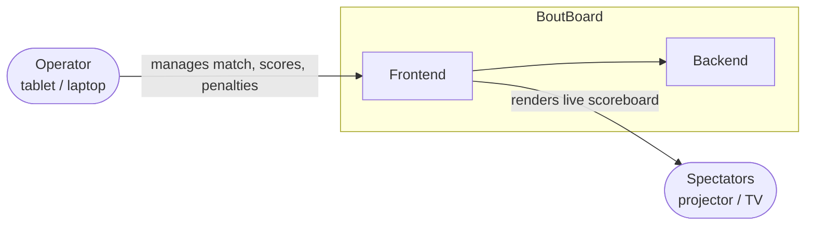
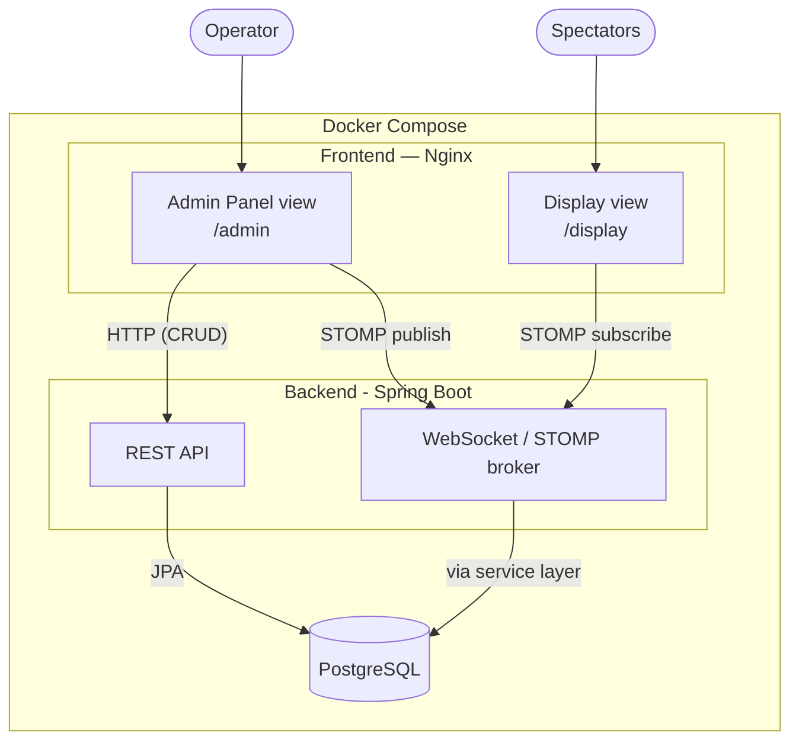
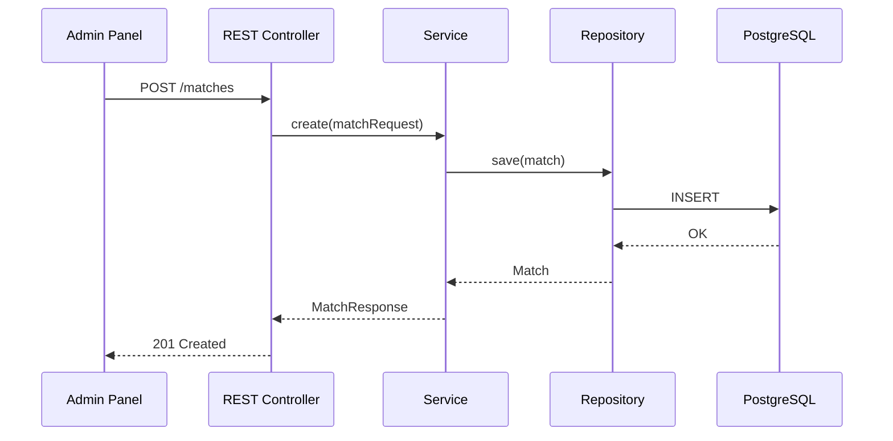
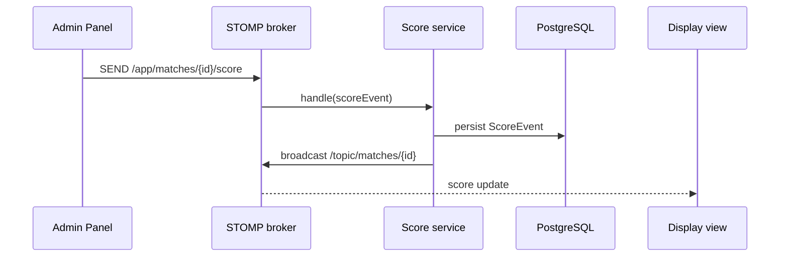

# System architecture overview
#architecture #overview #database #deployment #frontend-architecture #backend-architecture #request-lifecycle #websocket-flow #workflows #decisions #backend #frontend #api
This document is the entry point into BoutBoard's architecture. It describes the system as a whole — its actors, its major components, how they communicate, and the principles behind those choices. It intentionally does **not** go deep into any single component; each section links to a dedicated document for that depth.

If you haven't read [README](../README.md)` yet, start there first.

## System context

BoutBoard has two human actors and no external systems (yet — see [Project scope](#project-scope) below).

- **Operator** — runs the match from the Admin Panel: starts/stops the clock, awards or revokes points and penalties, and confirms the winner. Typically a tablet or laptop at the scoring table.
- **Spectators** — watch the Display view, projected on a TV or screen. This view is read-only; it never sends data, only receives it.

A **Judge** actor is planned but not yet implemented — see [Authentication](Authentication.md) and decision 0003.

## Architectural principles

These are the recurring decisions that shape every layer of the system. Each is backed by a full ADR in `decisions/`; this is the short version.

| Principle                                      | What it means in practice                                                                                                                                                                        | ADR                                                         |
| ---------------------------------------------- | ------------------------------------------------------------------------------------------------------------------------------------------------------------------------------------------------ | ----------------------------------------------------------- |
| **Rules are configuration, not code**          | Match duration, point values, and win conditions live in a `SportRuleSet`, not in hardcoded `if` statements. WKF Karate Kumite ships as the default configuration, not a special case.           | [0003](../decisions/0003-configurable-rules-engine.md)      |
| **Two channels, two purposes**                 | REST handles CRUD (participants, judges, matches — anything that isn't time-sensitive). WebSocket/STOMP handles live match events (scores, penalties, clock). Neither replaces the other.        | [Websocket-flow](Websocket-flow.md)                         |
| **Monorepo**                                   | Frontend and backend version together, in one PR history, one issue tracker.                                                                                                                     | [0001](../decisions/0001-monorepo-structure.md)             |
| **Standard library over third-party protocol** | Native WebSocket + STOMP (Spring's built-in support) instead of Socket.IO, to stay inside a well-documented, first-party integration path.                                                       | [0002](../decisions/0002-native-websocket-over-socketio.md) |
| **Read-only display, stateful operator**       | The Display view holds no authority — it can be refreshed, closed, or duplicated on a second screen with zero risk of corrupting match state, because the backend is the single source of truth. | —                                                           |

## High-level component diagram

## Component responsibilities

| Component                   | Responsibility                                                   | Technology                     | Detail                                    |
| --------------------------- | ---------------------------------------------------------------- | ------------------------------ | ----------------------------------------- |
| Admin Panel                 | Match setup, live scoring controls, participant/judge management | Vue 3, Vuetify, Pinia          | `frontend-architecture.md`                |
| Display view                | Read-only live scoreboard for spectators                         | Vue 3                          | `frontend-architecture.md`                |
| REST API                    | CRUD for participants, judges, matches, categories               | Spring Boot (Web, Data JPA)    | [Request-lifecycle](Request-lifecycle.md) |
| WebSocket / STOMP broker    | Real-time score, penalty, and clock events                       | Spring Boot (WebSocket, STOMP) | [websocket](../backend/websocket.md)      |
| Database                    | Persistent storage of all match and tournament data              | PostgreSQL, Flyway             | [Database](Database.md)                   |
| Reverse proxy / static host | Serves the built frontend                                        | Nginx                          | [Deployment](Deployment.md)               |

## Data flow summary

Two independent flows cover everything the system does. Each has its own dedicated document with a full sequence diagram — these are the abbreviated versions, enough to see the shape before going deeper.

### 1. REST flow — anything that isn't time-critical

Full detail: [Request-lifecycle](Request-lifecycle.md).

### 2. WebSocket flow — anything happening live, mid-match

Full detail: [Websocket-flow](Websocket-flow.md).

## Cross-cutting concerns

Brief pointers — each has its own document.

- **Database & migrations**: schema evolves through versioned Flyway scripts, never manual changes to a running database. See [Database](Database.md).
- **Authentication** _(planned)_: role-based access (Operator vs read-only) via Spring Security + JWT. Not implemented in the current scope. See [Authentication](Authentication.md).
- **Deployment**: single `docker-compose.yml` orchestrating frontend, backend, and database containers. See [Deployment](Deployment.md).
- **CI/CD**: GitHub Actions builds and tests both frontend and backend on every push and pull request. See [ci-cd](../workflows/ci-cd.md).

## Project scope

To keep expectations calibrated for contributors — this reflects the current state, not the ambition:

| Area                                                   | Status                                                      |
| ------------------------------------------------------ | ----------------------------------------------------------- |
| Single-match live scoreboard (WKF Karate Kumite rules) | In progress                                                 |
| Real-time display sync (WebSocket)                     | In progress                                                 |
| Participant / judge registration                       | In progress                                                 |
| Group-stage tournament structure                       | Planned                                                     |
| Multi-judge consensus scoring                          | Planned                                                     |
| Authentication / roles                                 | Planned                                                     |
| Configurable rule sets for other sports                | Planned (architecture supports it; only Kumite ships today) |

## Where to go next

| I want to understand...                  | Go to                                             |     |
| ---------------------------------------- | ------------------------------------------------- | --- |
| The backend's internal package structure | [Backend-architecture](Backend-architecture.md)   |     |
| The frontend's internal structure        | [Frontend-architecture](Frontend-architecture.md) |     |
| A REST request in full detail            | [Request-lifecycle](Request-lifecycle.md)         |     |
| A live scoring event in full detail      | [Websocket-flow](Websocket-flow.md)               |     |
| The database schema                      | [Database](Database.md)                           |     |
| How this gets deployed                   | [Deployment](Deployment.md)                       |     |
| Why a specific decision was made         | [Decisions](../decisions/README.md)               |     |
