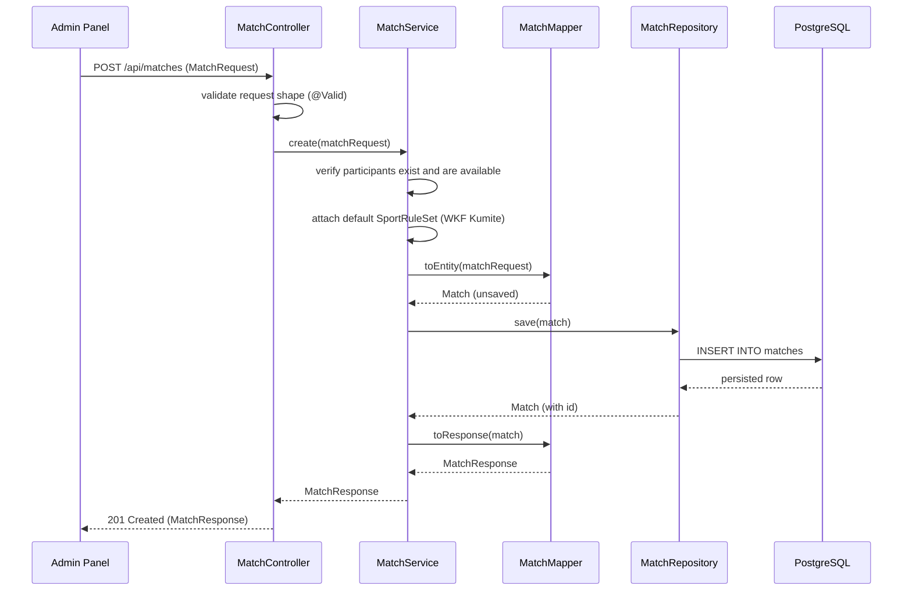
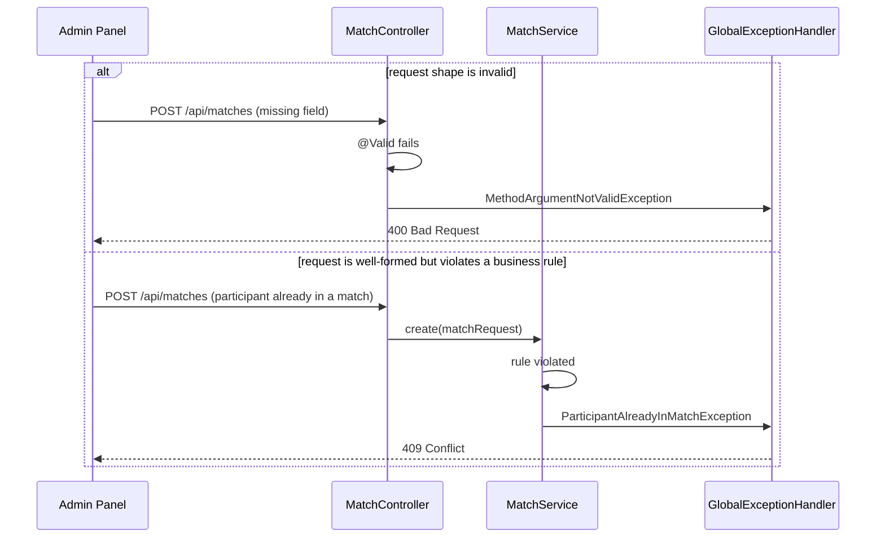

# Request lifecycle
#architecture 
This document walks a single REST request through every backend layer, in full detail — the deep-dive version of the abbreviated diagram in [Overview](Overview.md). It covers both the happy path and how errors surface back to the client.

## Worked example: creating a match

To keep this concrete rather than abstract, every step below is illustrated against one real request: an operator creating a new match between two registered participants.

```
POST /api/matches
{ "participantAId": ..., "participantBId": ..., "categoryId": ... }
```

### Happy path



Step by step, mapped to the folders responsible for each:

1. **`controller/`** receives the HTTP request and validates its _shape_ — are required fields present, do IDs look like valid UUIDs — using Bean Validation annotations on the request DTO. This is a structural check only; it has no idea whether the referenced participants actually exist.
2. **`service/`** receives the validated DTO and applies domain rules: do these participants exist, are they already in another active match, is the category valid. This is also where the default `SportRuleSet` gets attached to the new match (see [ADR-0003](../decisions/0003-configurable-rules-engine.md)) — a new match is born already knowing its scoring rules, not deciding them later.
3. **`mapper/`** converts the request DTO into a `Match` entity before persistence, and later converts the persisted entity back into a response DTO.
4. **`repository/`** persists the entity. This is the only layer that issues SQL.
5. **`controller/`** wraps the returned DTO in a `201 Created` response.

### Error path

Two different kinds of failure surface at two different layers, and it matters which:



- **Shape-level errors** (missing/malformed fields) never reach `service/` at all — they're rejected at the `controller/` boundary and typically map to `400 Bad Request`.
- **Business-rule violations** (a well-formed request that breaks a domain rule) are only detectable inside `service/`, since only that layer knows the rule. These are raised as custom exceptions defined in `exception/` and typically map to `409 Conflict` or `422 Unprocessable Entity`, depending on the specific rule.
- Both paths converge on the same `GlobalExceptionHandler`, which is why the client always receives a consistently shaped error response regardless of which layer rejected the request. See `exception/` for the full convention.

## Layer responsibility recap

| Layer         | Answers                                                       | Detail                                 |
| ------------- | ------------------------------------------------------------- | -------------------------------------- |
| `controller/` | Is this request shaped correctly?                             | [controller](../backend/controller.md) |
| `service/`    | Is this request _allowed_, given current state and rules?     | [service](../backend/service.md)       |
| `mapper/`     | How does this data look on each side of the boundary?         | [mapper](../backend/mapper.md)         |
| `repository/` | How is this data stored and retrieved?                        | [repository](../backend/repository.md) |
| `exception/`  | How do failures at any layer become a client-facing response? | [exception](../backend/exception.md)   |

## What this document doesn't cover

Real-time events (scores, penalties, clock updates) don't follow this REST path at all — see [Websocket-flow](Websocket-flow.md) for the parallel flow those take.