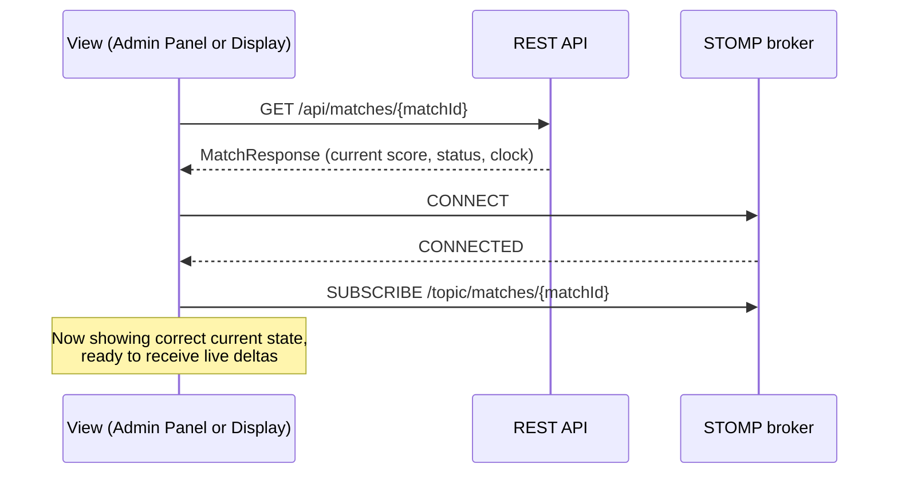
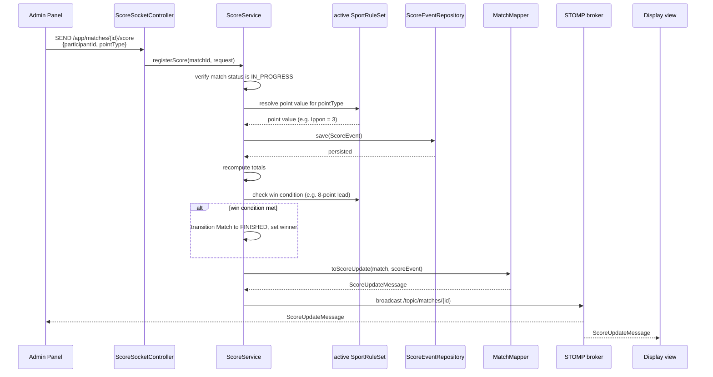

# WebSocket event flow
#architecture 
This document walks a real-time score event through the full system, in full detail — the deep-dive version of the abbreviated diagram in [Overview](Overview.md). It also covers connection setup and reconnection, which the overview skips entirely.

## Two-phase pattern: hydrate, then subscribe

A WebSocket subscription only delivers events that happen _after_ the subscription starts — it has no memory of what happened before. A client that only subscribed would show nothing until the next score event, even if the match is already halfway through. To avoid that, both the Admin Panel and the Display view follow the same two-phase pattern on load (and on reconnect):

This is also why the REST and WebSocket flows aren't really separate systems — every real-time session begins with one REST call. See [Request-lifecycle](Request-lifecycle.md) for how that initial `GET` is handled.

## Publishing and broadcasting a score event

Once subscribed, here's the full path of a single scoring action — the operator awarding a point — from the Admin Panel to every subscribed screen.

What's happening at each stage:

1. **`websocket/`** receives the STOMP frame and does nothing but hand it to the service layer — it has no opinion on whether the event is valid.
2. **`service/`** does the actual work: confirms the match can accept a score right now, resolves the point value and win condition against the match's active `SportRuleSet` rather than hardcoded Kumite logic (see [ADR- 0003](../decisions/0003-configurable-rules-engine.md)), and persists the event via `repository/`.
3. If the new total meets the rule set's win condition, the match itself transitions state within the same service operation — the client never needs to send a separate "end match" action.
4. **`mapper/`** shapes the outgoing broadcast message the same way it shapes REST responses, keeping one conversion convention across both channels.
5. The broker broadcasts to **every** subscriber of that match's topic — the Admin Panel included. The Admin Panel doesn't update its own UI optimistically on send; it waits for the same broadcast the Display view gets. This is deliberate: see [Overview](Overview.md) "read-only display, stateful operator" principle — extended here, _neither_ client trusts its own local action until the backend confirms it, so both screens are guaranteed to agree.

## Reconnection behavior

[ADR-0002](../decisions/0002-native-websocket-over-socketio.md) notes that moving off Socket.IO means giving up its built-in reconnection handling. The consequence is scoped narrowly:

- The STOMP client is configured to retry the connection automatically on drop.
- On reconnect, a client re-runs the same **hydrate, then subscribe** sequence from the top of this document — it doesn't try to replay missed events individually.
- Because the Display view holds no authority over match state (it only ever reflects what the backend last told it), a connection gap produces a stale screen for a few seconds at worst, never an incorrect or corrupted one. The Admin Panel follows the same hydrate step on reconnect, so an operator briefly disconnected mid-match sees the authoritative current state, not a stale local copy.

## What this document doesn't cover

Non-time-critical operations — registering a participant, creating a match, managing judges — don't go through this channel at all. See [Request-lifecycle](Request-lifecycle.md) for that flow.